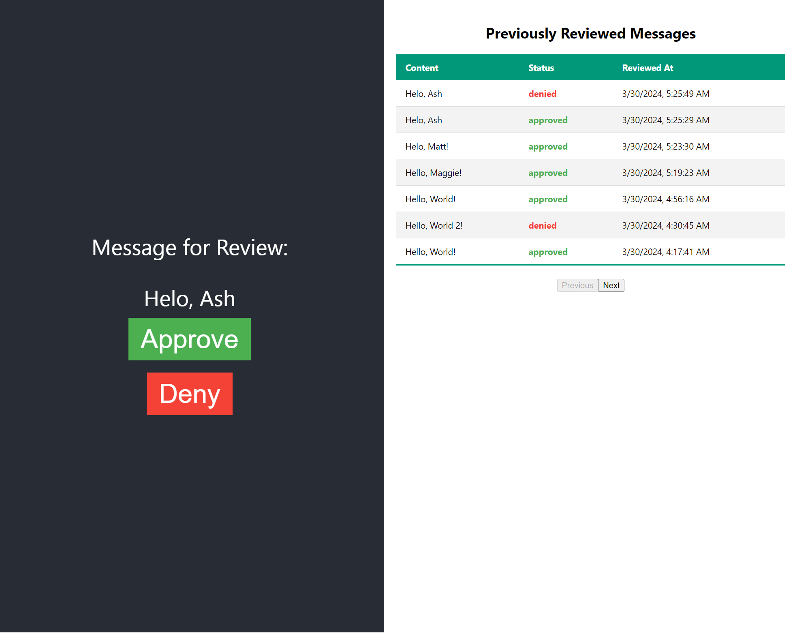

# Human In The Loop

This project uses Cloudflare as a minimal backend to demonstrate a simple Human in the Loop review system for AI prompts that get flagged for Human Review.

## Architecture
- Cloudflare Pages
- Cloudflare Workers
- Cloudflare D1
- Cloudflare Queue

## Frontend (Cloudflare Pages)
[README.md for frontend](./frontend/README.md)

## Backend (Cloudflare Workers, D1, Queue)
[README.md for backend](./backend/README.md)